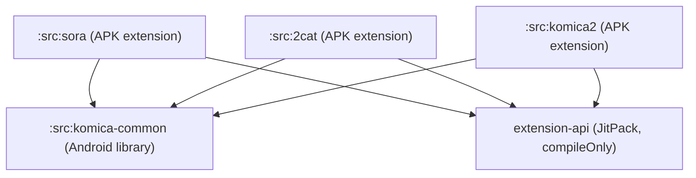

# komica-common

Komica 系列看板（Sora、2cat、komica2）的共享 HTTP 解析器與 API 客戶端。
由三個薄 extension 共同依賴，避免重複維護解析邏輯。

---

## 模組依賴圖

---

## 架構 Trade-off

`komica-common` 是一個 Android library 模組，建置時會被各 extension bundle 進自己的 APK，**而非作為共用的 runtime 依賴**。

這意味著：

- 每個 APK（sora、2cat、komica2）都包含一份 komica-common 的代碼副本
- 三個 APK 各自獨立部署，不需要協調版本相依性

這是刻意的設計：

| 考量 | 說明 |
|------|------|
| **獨立部署** | 三個 extension 可以各自發版，互不影響 |
| **版本演進自由** | 若某個 extension 需要修改解析邏輯，不會影響其他 extension |
| **代價** | 每個 APK 多了約數十 KB 的代碼體積，可接受 |

若未來解析邏輯大幅分歧，各 extension 可直接 fork komica-common 的代碼，不需要維護 shared library 的 API 相容性。
