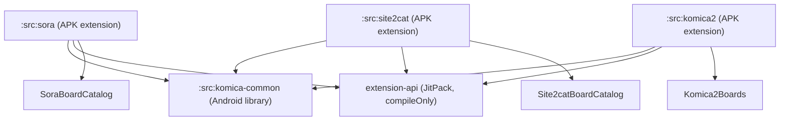

# komica-common

---
`komica-common` 是一個 Android library 模組，建置時會被 sora、site2cat、komica2 打包進自己的 APK，**而非作為共用的 runtime 依賴**。

本模組只保存三個 extension 共用的解析模型與基礎介面，例如 `KPost`、
`KParagraph`、parser 與 request contracts。板面目錄由能實際解析該頁面格式的
extension 自行管理：

- `sora/SoraBoardCatalog.kt`
- `site2cat/Site2catBoardCatalog.kt`
- `komica2/model/Komica2Boards.kt`

Komica 聯合站的目錄分類、板面 URL 與顯示順序不屬於 common parser contract，
因此不應加入此模組。

這意味著：

- 每個 APK（sora、site2cat、komica2）都包含一份 komica-common 的代碼副本
- 三個 APK 各自獨立部署，不需要協調版本相依性

這是刻意的設計：

| 考量 | 說明 |
|------|------|
| **獨立部署** | 三個 extension 可以各自發版，互不影響 |
| **版本演進自由** | 若某個 extension 需要修改解析邏輯，不會影響其他 extension |
| **代價** | 每個 APK 多了約數十 KB 的代碼體積，可接受 |

---

## 模組依賴圖

```mermaid
graph TD
    extension-api["extension-api (JitPack, compileOnly)"]
    komica-common[":src:komica-common (Android library)"]
    sora[":src:sora (APK extension)"]
    site2cat[":src:site2cat (APK extension)"]
    komica2[":src:komica2 (APK extension)"]
    soraBoards["SoraBoardCatalog"]
    site2catBoards["Site2catBoardCatalog"]
    komica2Boards["Komica2Boards"]

    sora --> komica-common
    site2cat --> komica-common
    komica2 --> komica-common
    sora --> extension-api
    site2cat --> extension-api
    komica2 --> extension-api
    sora --> soraBoards
    site2cat --> site2catBoards
    komica2 --> komica2Boards
```
