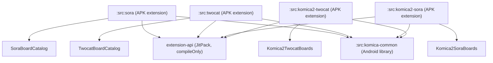

# komica-common

---
`komica-common` 是一個 Android library 模組，建置時會被各 Komica extension 打包進自己的 APK，**而非作為共用的 runtime 依賴**。

本模組保存解析模型、基礎介面，以及 `pixmicat` package 內可共用的 Komica2
Pixmicat parser、request engine 與 URL normalization。板面目錄仍由能實際解析
該頁面格式的 extension 自行管理：

- `sora/SoraBoardCatalog.kt`
- `twocat/TwocatBoardCatalog.kt`
- `komica2-sora/model/Komica2SoraBoards.kt`
- `komica2-twocat/model/Komica2TwocatBoards.kt`

Komica 聯合站的目錄分類、板面 URL 與顯示順序不屬於 common parser contract，
因此不應加入此模組。

這意味著：

- 每個 APK（sora、twocat、komica2-sora、komica2-twocat）都包含一份 komica-common 的代碼副本
- 各 APK 獨立部署，不需要協調版本相依性

這是刻意的設計：

| 考量 | 說明 |
|------|------|
| **獨立部署** | 三個 extension 可以各自發版，互不影響 |
| **版本演進自由** | 若某個 extension 需要修改解析邏輯，不會影響其他 extension |
| **代價** | 每個 APK 多了約數十 KB 的代碼體積，可接受 |

---

## 模組依賴圖

```mermaid
graph TD
    extension-api["extension-api (JitPack, compileOnly)"]
    komica-common[":src:komica-common (Android library)"]
    sora[":src:sora (APK extension)"]
    twocat[":src:twocat (APK extension)"]
    komica2Sora[":src:komica2-sora (APK extension)"]
    komica2Twocat[":src:komica2-twocat (APK extension)"]
    soraBoards["SoraBoardCatalog"]
    twocatBoards["TwocatBoardCatalog"]
    komica2SoraBoards["Komica2SoraBoards"]
    komica2TwocatBoards["Komica2TwocatBoards"]

    sora --> komica-common
    twocat --> komica-common
    komica2Sora --> komica-common
    komica2Twocat --> komica-common
    sora --> extension-api
    twocat --> extension-api
    komica2Sora --> extension-api
    komica2Twocat --> extension-api
    sora --> soraBoards
    twocat --> twocatBoards
    komica2Sora --> komica2SoraBoards
    komica2Twocat --> komica2TwocatBoards
```
